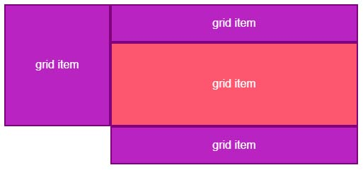
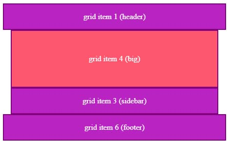

# Formatting grid areas and making them responsive

- Making a blank/empty area in a grid
- Using em/rem and auto for column width and empty columns
- Use media queries to redefine the grid
- minmax()
- The 'fr' unit
- repeat()
- auto-fit & auto-fill
## Making a blank/empty area in a grid

Use a dot in a grid area definitiion to indicate that the area is empty.



```css
.grid {
    display: grid;
    grid-template-columns: 150px 150px 200px;
    grid-template-areas: 
        "sidebar header header" 
        "sidebar content content"
        ". footer footer";
}
```

Multiple dots can also be used, for readability.

```css
.grid {
    display: grid;
    grid-template-columns: 150px 150px 200px;
    grid-template-areas: 
        "sidebar header  header" 
        "sidebar content content"
        "....... footer  footer";
}
```

## Using em/rem and auto for column width and empty columns

This is an easy way to format a grid so the content is narrower than the header & footer.



```css
.grid {
    display: grid;
    /* This variation is responsive, with stacked rows */
    grid-template-columns: 1em auto 1em;
    grid-template-areas: 
        "header header header"
        ". content ."
        ". sidebar ."
        "footer footer footer"
}
```

Note that the `grid-template-columns` has a left and right column with a width of `1em`. The main content in the middle column is set to `auto` so it will take up the remaining width.

- [Codepen: grid-template-areas-2](https://codepen.io/vishalicious/pen/yLxbWQp)

## Use media queries to redefine the grid

`grid-template-columns` and `grid-template-areas` can be redefined at different widths using media queries. This can be used to change a page's layout based on screen size.

```css
.grid {
  display: grid;
  grid-template-columns: 5em auto 5em;
  grid-template-areas: 
    "header header header"
    ". content ."
    ". sidebar ."
    "footer footer footer"
}

@media (min-width: 600px) {
  .grid {
    grid-template-columns: 100px 300px 100px 100px;
    grid-template-areas: 
      "header header  header  header"
      "...... content sidebar ......"
      "footer footer  footer  footer";
  }
}
```

The above example starts small screens with a horizontally-aligned content and sidebar and adjusts them to side-by-side when the screen width is wide enough.

- [Codepen: Using media queries to redefine the grid](https://codepen.io/vishalicious/pen/bGxRWoE)

## minmax()

- New value that sets a __minumum width__ and __maximum width__ to columns & rows
- Assign two values, inside of parenthesis, separated by a comma
    - __left__ side is always __minumum__ value
    - __right__ side is always __maximum__ value
    - ex: `minmax(100px, 300px)`
    - ex: `minmax(3em, 10em)`
    - ex: `minmax(200px, 50%)`
- [Codepen: minmax()](https://codepen.io/vishalicious/pen/mdGMXxo)

## The 'fr' unit

- The `fr` unit is used to distribute a __fraction__ of the available space
    - It grows/shrinks at a __ratio__, like `flex-grow` and `flex-shrink`
        - `1fr` is "normal" speed, `2fr` grows/shrinks faster, `3fr` is even more, etc.
    - It's size is determined by the content and available space
    - *It's the easiest way to create columns of equal size*
    - `fr` units __cannot__ be used as the __minumum width__ in a `minmax()`
        - They __can__ be used as the __maximum width__ in a `minmax()`
- Using this for the size of a grid-item turns it into a flexible item that behaves much like a flex item does when it's set to `flex: 1 1 auto;`
    - `flex: 1 1 auto;` is like setting:
        - `flex-grow` (how much remaining space is allocated to an item in a container)
        - `flex-shrink` (what fraction to reduce an item to in a container - larger # is smaller size)
        - `flex-basis` (sets the initial main size of an item in a container)
    - The item is sized according to its `width` and `height` properties, but grows to absorb any extra free space in the flex container, and shrinks to its minimum size to fit the container
- [Codepen: The 'fr' unit](https://codepen.io/vishalicious/pen/OJojZMO)

## repeat()

- When defining `grid-template-rows` or `grid-template-columns` if we have multiple columns that are the same width, we can use `repeat()` to specify how many times to duplicate a row or column
    - First, define how many times we want a row/column to be repeated
    - Then, define the size (# of repeats and size must be comma-separated)

```css
/* four-column grid example */
.example {
    display: grid;
    grid-template-columns: repeat(4, 300px);
}

/* 3 same-sized, responsive columns */
.example2 {
    display: grid;
    grid-template-columns: repeat(3, 1fr);
}
```

- [Codepen: repeat()](https://codepen.io/vishalicious/pen/poOrVBz)

## auto-fit & auto-fill

- When using `repeat()` instead of a set number of times, we can use `auto-fit` or `auto-fill` to add grid-items
    - `auto-fit` will fit the defined columns into the available space
    - `auto-fill` will keep adding columns, even empty ones, as long as there's space
- These values are best paired with a `minmax()`
- These options are good ways to make responsive grids that render many cards

### auto-fill example

```css
.portfolio {
    padding: 1em;
    display: grid;
    grid-template-columns: repeat(auto-fill, minmax(200px, 1fr));
    grid-gap: 1em;
} 
```

- [Codepen: auto-fill](https://codepen.io/vishalicious/pen/NWLvzRQ)

### auto-fit example


```css
.portfolio {
    padding: 1em;
    display: grid;
    grid-template-columns: repeat(auto-fit, minmax(200px, 1fr));
    grid-gap: 1em;
} 
```

- [Codepen: auto-fit](https://codepen.io/vishalicious/pen/VwGzdPd)
