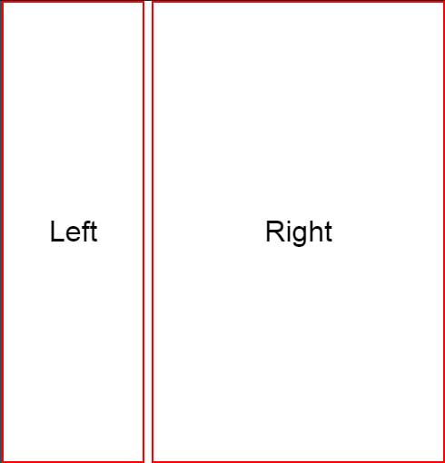
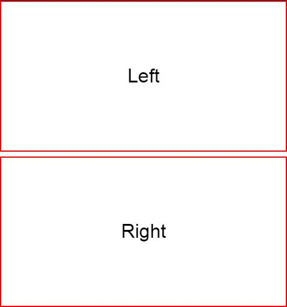

# CSS Grid - 2-Row/Column Responsive Layout

This grid has 2 columns at widescreen which turn into 2 rows at mobile. They use the grid lines to determine starting and ending positions. The code is a simplified version of an example from YouTube (see Resources).

* grid-column specifies what grid line to start/stop a given column at
* At mobile size, grid-gap gives the row-gap first and column-gap second

Desktop:



Mobile:



A live example is published [here](https://codepen.io/vishalicious/pen/JjROrGB?editors=0100).

## Code

__HTML__

```html
<section class='container'>
  <div class='box-1 boxes'>Left</div>
  <div class='box-2 boxes'>Right</div>
</section>
```

__CSS__

```css
* {
  margin: 0px;
  padding: 0px;
  box-sizing: border-box;
}

body {
  font-family: sans-serif;
  font-size: 2rem;
}

.container {
  display: grid;
  height: 100vh;
  grid-gap: .5rem;
  grid-template-columns: repeat(12, 1fr);
}

.boxes {
  display: grid;
  place-items: center;
  border: 2px solid red;
}

.box-1 {
  grid-column: 1/5;
}

.box-2 {
  grid-column: 5/13;
}

@media (max-width: 480px) {
  .container {
    grid-template-columns: 100%;
    grid-gap: .5rem 0;
  }
  
  .box1, .box-2 {
    grid-column: inherit;
  }
}
```

## Resources
* [Mastering CSS Grid Model in 2021🔥 - Build 5 Layouts || CSS 2021](https://www.youtube.com/watch?v=OtpDP8k-2iM)