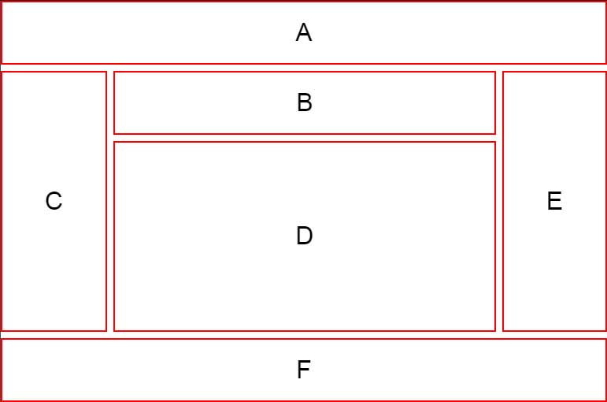
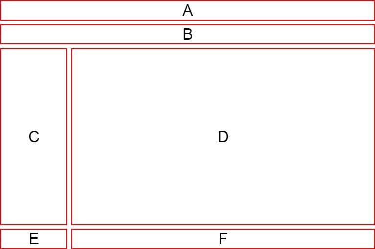
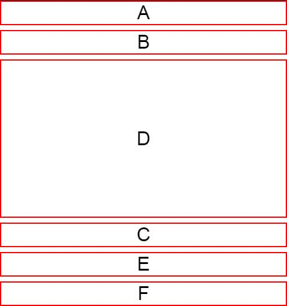

# CSS Grid - 6-Box Responsive Layout

This grid has 6 boxes which change configuration when switching from fullscreen to tablet and then to mobile view. It makes use of grid-template-areas to specify layout at each size. grid-template-rows was also used to specify the row heights in each view. The code is a simplified version of an example from YouTube (see Resources).

* grid-area assigns a grid-area name to a container
* grid-template-areas used the grid-area for each container to visually specify their location in the layout
  * spaces are for visual clarity, they have no bearing on the code

Desktop:



Tablet:



Mobile:



A live example is published [here](https://codepen.io/vishalicious/pen/qBaVPPg?editors=0100).

## Code

__HTML__

```html
<section class='container'>
  <div class='box-1 boxes'>A</div>
  <div class='box-2 boxes'>B</div>
  <div class='box-3 boxes'>C</div>
  <div class='box-4 boxes'>D</div>
  <div class='box-5 boxes'>E</div>
  <div class='box-6 boxes'>F</div>
</section>
```

__CSS__

```css
* {
  margin: 0px;
  padding: 0px;
  box-sizing: border-box;
}

body {
  font-family: sans-serif;
  font-size: 2rem;
}

.container {
  display: grid;
  height: 100vh;
  grid-gap: .5rem;
  grid-template-areas:
    "a a a a   a a a a   a a a a"
    "c c b b   b b b b   b b e e"
    "c c d d   d d d d   d d e e"
    "f f f f   f f f f   f f f f";
  grid-template-rows: 1fr 1fr 3fr 1fr
}

.boxes {
  display: grid;
  place-items: center;
  border: 2px solid red;
}

.box-1 {
  grid-area: a;
}

.box-2 {
  grid-area: b;
}

.box-3 {
  grid-area: c;
}

.box-4 {
  grid-area: d;
}

.box-5 {
  grid-area: e;
}

.box-6 {
  grid-area: f;
}

@media (max-width: 768px) {
  .container {
    grid-template-areas:
      "a a a a   a a a a   a a a a"
      "b b b b   b b b b   b b b b"
      "c c d d   d d d d   d d d d"
      "e e f f   f f f f   f f f f";
    grid-template-rows: auto auto 1fr auto;
  }
}

@media (max-width: 480px) {
  .container {
    grid-template-areas:
      "a a a a   a a a a   a a a a"
      "b b b b   b b b b   b b b b"
      "d d d d   d d d d   d d d d"
      "c c c c   c c c c   c c c c"
      "e e e e   e e e e   e e e e "
      "f f f f   f f f f   f f f f";
    grid-template-rows: auto auto 1fr auto auto auto;
  }
}
```

## Resources
* [Mastering CSS Grid Model in 2021🔥 - Build 5 Layouts || CSS 2021](https://www.youtube.com/watch?v=OtpDP8k-2iM)